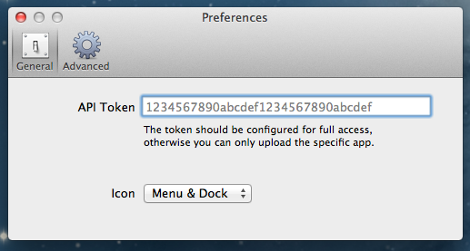
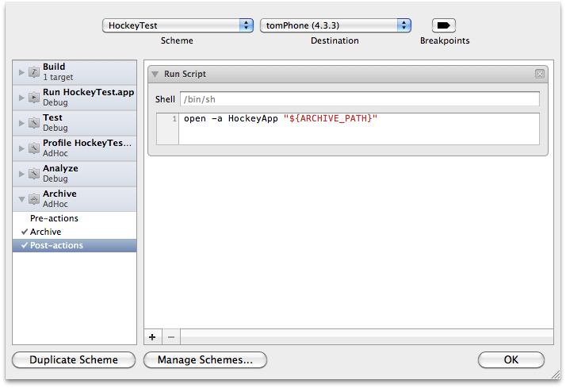

## Introduction

HockeyMac is a simple client application for Mac OS 10.6 or higher to upload files to HockeyApp. After the installation, you can drag & drop either .ipa files or .xcarchive bundles to the dock or menu icon. HockeyMac will then open a window to enter release notes and set the download flag of the version. The upload is shown with a progress bar and there is some minimal error handling.

This document contains the following sections:

- [Prerequisites](#prerequisites)
- [Installation](#installation)
- [Integration With Xcode 4](#xcode)
- [Command Line Options](#cmd)
- [Bugs Or Questions](#bugs)

 
## Prerequisites

1. Mac OS X 10.6
2. Xcode 4

 
## Installation

1. Download the latest version from [here](https://rink.hockeyapp.net/api/2/apps/67503a7926431872c4b6c1549f5bd6b1?format=zip).
2. Extract the .zip archive.
3. Copy HockeyApp to your Application folder.
4. Start HockeyApp.
5. If this is your first start, the app automatically shows the Preferences dialog:

    

6. You need to enter your HockeyApp API token. If you don't have one, then create one [here](https://rink.hockeyapp.net/manage/auth_tokens).
7. Close the dialog and you're ready to go.

 
## Integration With Xcode 4

1. Open your project.
2. Select `Product` > `Edit Scheme`.
3. Expand `Archive`.
4. Select `Post-actions`.
5. Click the `+` in the lower left corner of the right pane and select `New Run Script Action`.
6. Select your project for the build settings and enter the following command below:<pre>open -a HockeyApp "${ARCHIVE_PATH}"</pre>

    
7. Confirm with `OK`.

If you now build your product with Build & Archive and the build was successful, the .xcarchive is automatically opened with HockeyMac. You can enter your release notes and then HockeyMac creates and uploads both the .ipa and the .dSYM file. Please note that you have to configure the correct provisioning profile for AdHoc distribution in the build configuration that you use for Build & Archive.

	
 
## Command Line Options

You can specify the following command line options:

* autoSubmit - the .ipa or .xcarchive will be automatically uploaded after it has been opened; you will see the progress bar, but not have the chance to specify release notes; after the upload is finished HockeyApp will be closed.
* downloadOff - the checkbox "Download" will be set to off after the file was opened.
* identifier - upload to app with this public identifier
* notes - absolute path to release notes file
* notifyOn - the checkbox "Notify" will be set to on after the file was opened.
* onlyIPA - only for .xcarchive files; uploads only the .ipa file
* onlyDSYM - only for .xcarchive files; uploads only the .dSYM.zip file
* openNoPage - do nothing after upload was successful
* openDownloadPage - open the download page after upload was successful
* openVersionPage - open the version page after upload was successful
* setAlpha - set release type to 'alpha'
* setBeta - set release type to 'beta'
* setLive - set release type to 'live'
* tags - only allow users who are tagged by these tags to download the app (restrict downloads)
* token - use this api token instead of the one configured in settings.

Please note that the command line options are passed to the app only at the first start. If the HockeyMac is already running, it will not consider any new arguments. In addition upload only tokens cause the app _NOT_ to be downloadable and notifications will _NOT_ be send.

Example:

<pre>open -a HockeyApp MyApp.xcarchive --args autoSubmit notifyOn openDownloadPage</pre>

HockeyMac will automatically upload MyApp.ipa and MyApp.dSYM.zip from the archive and notify all testers.

 
## Bugs Or Questions

If you have a problem, a question or a suggestion, please let us know via email to support@hockeyapp.net or our [support forums](http://support.hockeyapp.net). We appreciate any feedback!
