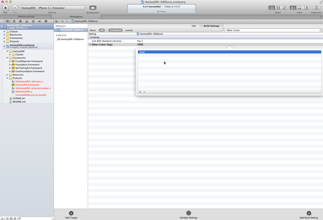

## Introduction

This article describes how to integrate HockeyApp into your iOS apps. The SDK allows testers to update your app to another beta version right from within the application. It will notify the tester if a new update is available. The SDK also allows to send crash reports. If a crash has happened, it will ask the tester on the next start whether he wants to send information about the crash to the server.

This document contains the following sections:

- [Requirements](#requirements)
- [Download & Extract](#download)
- [Set up Xcode](#xcode)
- [Modify Code](#modify)
- [Submit the UDID](#udid)
- [Mac Desktop Uploader](#mac)
- [Xcode Documentation](#documentation)

 
## Requirements

The SDK runs on devices with iOS 4.0 or higher.

If you need support for iOS 3.x, please check out [HockeyKit](http://support.hockeyapp.net/kb/client-integration/beta-distribution-on-ios-hockeykit) and [QuincyKit](http://support.hockeyapp.net/kb/client-integration/crash-reporting-on-ios-quincykit)

 
## Download & Extract

1. Download the latest [HockeySDK-iOS](https://github.com/bitstadium/HockeySDK-iOS/downloads) framework.

2. Unzip the file. A new folder `HockeySDK-iOS` is created.

3. Move the folder into your project directory. We usually put 3rd-party code into a subdirectory named `Vendor`, so we move the directory into it.

 
## Set up Xcode

1. Drag & drop the `HockeySDK-iOS` folder from your project directory to your Xcode project.

2. Similar to above, our projects have a group `Vendor`, so we drop it there.

3. Select `Create groups for any added folders` and set the checkmark for your target. Then click `Finish`.

    

4. Select your project in the `Project Navigator` (⌘+1).

5. Select your target.

6. Select the tab `Summary`.

7. Expand `Link Binary With Libraries`.

8. The following entries should be present:
    * CoreGraphics.framework
    * Foundation.framework
    * HockeySDK.framework
    * QuartzCore.framework
    * SystemConfiguration.framework
    * UIKit.framework
    
    

9. If one of the frameworks is missing, then click the + button, search the framework and confirm with the `Add` button.

10. Select `Build Settings`

11. Search for `Other Linker Flags`

12. Double click on the build setting titled `Other Linker Flags`.

13. Add `-ObjC`
    
    

14. Search `Framework Search Paths`

15. Make sure that the list does not contain a path pointing to the `QuincyKit` SDK or another framework that contains `PLCrashReporter`
    
    

15. HockeySDK-iOS also needs a JSON library. If your deployment target iOS 5.0 or later, then you don't have to do anything. If your deployment target is iOS 4.x, please include one of the following libraries:
    * [JSONKit](https://github.com/johnezang/JSONKit)
    * [SBJSON](https://github.com/stig/json-framework)
    * [YAJL](https://github.com/gabriel/yajl-objc)

 
## Modify Code

1. Open your `AppDelegate.m` file.

2. Add the following line at the top of the file below your own #import statements:

        #import <HockeySDK/HockeySDK.h>

3. Let the AppDelegate implement the protocols `BITHockeyManagerDelegate`, `BITUpdateManagerDelegate` and `BITCrashManagerDelegate`:

        @interface AppDelegate() <BITHockeyManagerDelegate, BITUpdateManagerDelegate, BITCrashManagerDelegate> {}
        @end

4. Search for the method `application:didFinishLaunchingWithOptions:`

5. Add the following lines:

        [[BITHockeyManager sharedHockeyManager] configureWithBetaIdentifier:@"BETA_IDENTIFIER"
                                                             liveIdentifier:@"LIVE_IDENTIFIER"
                                                                   delegate:self];
        [[BITHockeyManager sharedHockeyManager] startManager];

6. Replace `BETA_IDENTIFIER` with the app identifier of your beta app. If you don't know what the app identifier is or how to find it, please read [this how-to](http://support.hockeyapp.net/kb/how-tos/how-to-find-the-app-identifier). 

7. Replace `LIVE_IDENTIFIER` with the app identifier of your release app.

 
## Submit the UDID

If you only want crash reporting, you can skip this step. If you want to use HockeyApp for beta distribution and analyze which testers have installed your app, you need to implement an additional delegate method in your AppDelegate.m:

    #pragma mark - BITUpdateManagerDelegate
    - (NSString *)customDeviceIdentifierForUpdateManager:(BITUpdateManager *)updateManager {
    #ifndef CONFIGURATION_AppStore
      if ([[UIDevice currentDevice] respondsToSelector:@selector(uniqueIdentifier)])
        return [[UIDevice currentDevice] performSelector:@selector(uniqueIdentifier)];
    #endif
      return nil;
    }
  
The method only returns the UDID when the build is not targeted to the App Sore. This assumes that a preprocessor macro name CONFIGURATION_AppStore exists and is set for App Store builds. You can define the macro as follows:

1. Select your project in the `Project Navigator` (⌘+1).

2. Select your target.

3. Select the tab `Build Settings`.

4. Search for `preprocessor macros`

    

5. Select the top-most line and double-click the value field.

6. Click the + button.

7. Enter the following string into the input field and finish with "Done".<pre><code>CONFIGURATION_$(CONFIGURATION)</code></pre>

    

Now you can use `#if defined (CONFIGURATION_AppStore)` statements in your code. If your configurations have different names, please adjust the above use of `CONFIGURATION_AppStore`.

 
## Mac Desktop Uploader

The Mac Desktop Uploader can provide easy uploading of your app versions to HockeyApp. Check out the [installation tutorial](Guide-Installation-Mac-App).

 
## Xcode Documentation

This documentation provides integrated help in Xcode for all public APIs and a set of additional tutorials and HowTos.

1. Download the latest [HockeySDK-iOS documentation](https://github.com/bitstadium/HockeySDK-iOS/downloads).

2. Unzip the file. A new folder `HockeySDK-iOS-documentation` is created.

3. Copy the content into ~`/Library/Developer/Shared/Documentation/DocSet`
