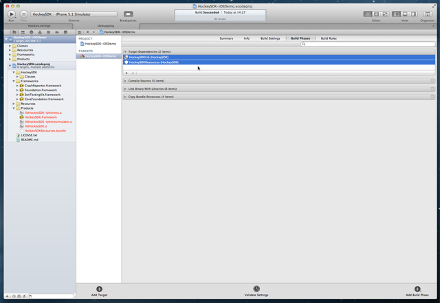
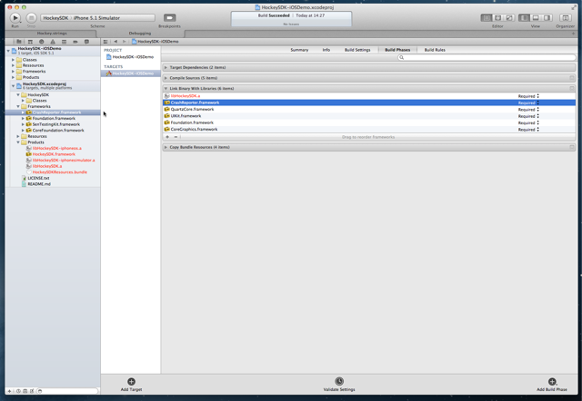
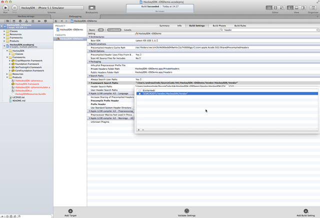

## Introduction

It is possible to install HockeySDK either using a [binary framework distribution](#framework) or as a [Xcode subproject](#subproject). While a binary distribution is a little easier to integrate and doesn't need to be compiled again, using a subproject allows you to debug through the code and make individual changes.

This document contains the following sections:

- [Prerequisites](#prerequisites)
- [Installation with binary framework distribution](#framework)
- [Installation as subproject](#subproject)
- [Setup HockeySDK](#setup)

 
## Prerequisites

1. Before you integrate HockeySDK into your own app, you should add the app to HockeyApp if you haven't already. Read [this how-to](http://support.hockeyapp.net/kb/how-tos/how-to-create-a-new-app) on how to do it.
2. We also assume that you already have a project in Xcode and that this project is opened in Xcode 4.
3. The SDK supports iOS 4.0 or newer.
4. Make sure any other crash reporting framework or exception handler is **disabled**!
5. Make sure previous versions of `PLCrashReporter` is removed! Search for `CrashReporter.framework` in your Project navigator.

 
## Installation with binary framework distribution

### Download & Extract

1. Download the latest [HockeySDK-iOS](https://github.com/bitstadium/HockeySDK-iOS/downloads) framework.
2. Unzip the file. A new folder `HockeySDK-iOS` is created.
3. Move the folder into your project directory. We usually put 3rd-party code into a subdirectory named `Vendor`, so we move the directory into it.

### Integrate into Xcode

1. Drag & drop the `HockeySDK-iOS` folder from your project directory to your Xcode project.
2. Similar to above, our projects have a group `Vendor`, so we drop it there.
3. Select `Create groups for any added folders` and set the checkmark for your target. Then click `Finish`.
4. Select your project in the `Project Navigator` (⌘+1).
5. Select your target.
6. Select the tab `Summary`.
7. Expand `Link Binary With Libraries`.
8. The following entries should be present:
	* `CrashReporter.framework`
	* `HockeySDK.framework`
	* `CoreGraphics.framework`
    * `Foundation.framework`
    * `QuartzCore.framework`
    * `SystemConfiguration.framework`
    * `UIKit.framework`

    
        
9. If one of the frameworks is missing, then click the + button, search the framework and confirm with the `Add` button.
10. Select `Build Phases`
11. The following entries should be present:
	* `HockeySDKResources.bundle`

    
        
12. Select `Build Settings`
13. Search for `Other Linker Flags`
14. Double click on the build Setting titled Other Linker Flags.
15. Add `-ObjC`

    

16. Hit `Done`.
17. Search for `preprocessor macros`

    

18. Select the top-most line and double-click the value field.
19. Click the + button.
20. Enter the following string into the input field and finish with "Done".<pre><code>CONFIGURATION_$(CONFIGURATION)</code></pre>

    

    Now you can use `#if defined (CONFIGURATION_ABCDEF)` directives in your code, where `ABCDEF` is the actual name of **YOUR** build configuration.

21. HockeySDK-iOS also needs a JSON library. If you deployment target iOS >= 5, everything is set. If your deployment target is iOS 4.x, please include one of the following libraries:
	* [JSONKit](https://github.com/johnezang/JSONKit)
	* [SBJSON](https://github.com/stig/json-framework)
	* [YAJL](https://github.com/gabriel/yajl-objc)
22. If you haven't installed `HockeyMac` desktop uploader, we highly recommend to follow the [installation instructions](Guide-Installation-Mac-App) to automatically invoke the uploader every time you archive a build
23. Select `Product` > `Edit Scheme`.
24. Expand `Archive`.
25. Select `Post-actions`.
26. Click the `+` in the lower left corner of the right pane and select `New Run Script Action`.
27. Select your project for the build settings and enter the following command below:<pre>open -a HockeyApp "${ARCHIVE_PATH}"</pre>
28. Confirm with `OK`.

 
## Installation as subproject

### Add the source as a Git Submodule

1. Open a Terminal window
2. Change to your projects directory `cd /path/to/MyProject'
3. If this is a new project, initialize Git: `git init`
4. Add the submodule: `git submodule add git://github.com/BitStadium/HockeySDK-iOS.git Vendor/HockeySDK`. This would add the submdolue into the `Vendor/HockeySDK` subfolder. Change this to the folder you prefer.

### Add HockeySDK to your project

1. Find the `HockeySDK.xcodeproj` file inside of the cloned HockeySDK-iOS project directory.
2. Drag & Drop it into the `Project Navigator` (⌘+1).
3. Select your project in the `Project Navigator` (⌘+1).
4. Select your target. 
5. Select the tab `Build Phases`.
6. Expand `Target Dependencies`.
7. Add the following dependencies:
	* `HockeySDKLib`
	* `HockeySDKResources`

    

8. Expand `Link Binary With Libraries`.
9. Add `libHockeySDK.a`

    

10. Drag & Drop `CrashReporter.framework` from the `Frameworks` folder in `HockeySDK.xcodeproj`

    

11. The following entries should be present:
	* `CrashReporter.framework`
	* `libHockeySDK.a`
	* `CoreGraphics.framework`
    * `Foundation.framework`
    * `QuartzCore.framework`
    * `SystemConfiguration.framework`
    * `UIKit.framework`

    

12. Expand `Copy Bundle Resources`.
13. Drag & Drop `HockeySDKResources.bundle` from the `Products` folder in `HockeySDK.xcodeproj`
14. Select `Build Settings`
15. In `Header Search Paths`, add a path to `$(SRCROOT)\Vendor\HockeyKit\Classes`

    

16. Search for `Other Linker Flags`
17. Double click on the build Setting titled Other Linker Flags.
18. Add `-ObjC`

    

19. Hit `Done`.
20. Search for `preprocessor macros`

    

21. Select the top-most line and double-click the value field.
22. Click the + button.
23. Enter the following string into the input field and finish with "Done".<pre><code>CONFIGURATION_$(CONFIGURATION)</code></pre>

    

    Now you can use `#if defined (CONFIGURATION_ABCDEF)` directives in your code, where `ABCDEF` is the actual name of **YOUR** build configuration.
24. HockeySDK-iOS also needs a JSON library. If you deployment target iOS >= 5, everything is set. If your deployment target is iOS 4.x, please include one of the following libraries:
	* [JSONKit](https://github.com/johnezang/JSONKit)
	* [SBJSON](https://github.com/stig/json-framework)
	* [YAJL](https://github.com/gabriel/yajl-objc)
	
25. If you haven't installed `HockeyMac` desktop uploader, we highly recommend to follow the [installation instructions](Guide-Installation-Mac-App) to automatically invoke the uploader every time you archive a build
26. Select `Product` > `Edit Scheme`.
27. Expand `Archive`.
28. Select `Post-actions`.
29. Click the `+` in the lower left corner of the right pane and select `New Run Script Action`.
30. Select your project for the build settings and enter the following command below:<pre>open -a HockeyApp "${ARCHIVE_PATH}"</pre>
31. Confirm with `OK`.

 
## Setup HockeySDK

1. Open your `AppDelegate.m` file.
2. Add the following line at the top of the file below your own #import statements:<pre><code>#import "HockeySDK.h"</code></pre>
3. Let the AppDelegate implement the protocols `BITHockeyManagerDelegate`, `BITUpdateManagerDelegate` and `BITCrashManagerDelegate`:<pre><code>@interface AppDelegate() &lt;BITHockeyManager, BITUpdateManager, BITCrashManager&gt; {}
@end</code></pre>
4. Search for the method `application:didFinishLaunchingWithOptions:`
5. Add the following lines:<pre><code>[[BITHockeyManager sharedHockeyManager] configureWithBetaIdentifier:@"BETA_IDENTIFIER" 
                                                        liveIdentifier:@"LIVE_IDENTIFIER"
                                                              delegate:self];
[[BITHockeyManager sharedHockeyManager].updateManager setDelegate:self];
[[BITHockeyManager sharedHockeyManager].crashManager setDelegate:self];
[[BITHockeyManager sharedHockeyManager] startManager];</code></pre>
6. Replace `BETA_IDENTIFIER` with the app identifier of your beta app. If you don't know what the app identifier is or how to find it, please read [this how-to](http://support.hockeyapp.net/kb/how-tos/how-to-find-the-app-identifier). 
7. Replace `LIVE_IDENTIFIER` with the app identifier of your release app.
8. Add the following method:<pre><code>- (NSString \*)customDeviceIdentifierForUpdateManager:(BITUpdateManager \*)updateManager {
\#ifndef CONFIGURATION_AppStore
  if ([[UIDevice currentDevice] respondsToSelector:@selector(uniqueIdentifier)])
    return [[UIDevice currentDevice] performSelector:@selector(uniqueIdentifier)];
\#endif
  return nil;
}</code></pre>This assumes that the Xcode build configuration used for App Store builds is named `AppStore`. Repleace this string with the appropriate Xcode configuration name.
9. If you have added the lines to `application:didFinishLaunchingWithOptions:`, you should be ready to go. If you do some GCD magic or added the lines at a different place, please make sure to invoke the above code on the main thread.
