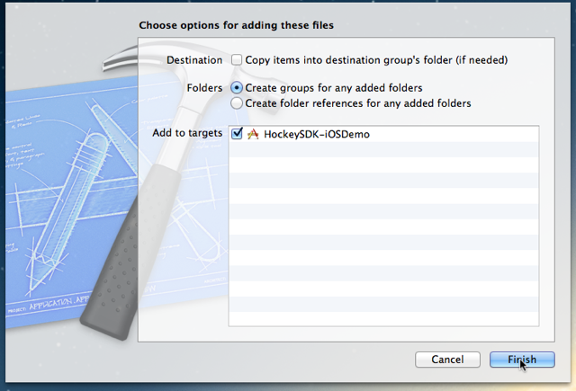
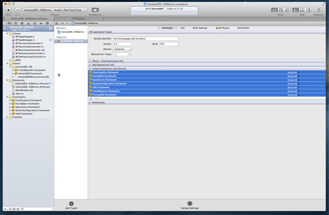

## Version 3.0.0

- [Changelog](http://www.hockeyapp.net/help/sdk/ios/3.0.0/docs/docs/Changelog.html)

## Introduction

This article describes how to integrate HockeyApp into your iOS apps. The SDK allows testers to update your app to another beta version right from within the application. It will notify the tester if a new update is available. The SDK also allows to send crash reports. If a crash has happened, it will ask the tester on the next start whether he wants to send information about the crash to the server.

This document contains the following sections:

- [Requirements](#requirements)
- [Download & Extract](#download)
- [Set up Xcode](#xcode)
- [Modify Code](#modify)
- [Submit the UDID](#udid)
- [Mac Desktop Uploader](#mac)
- [Xcode Documentation](#documentation)

 
## Requirements

The SDK runs on devices with iOS 5.0 or higher.

If you need support for iOS 4.x, please check out [HockeySDK v2.5.5](http://www.hockeyapp.net/releases/)

If you need support for iOS 3.x, please check out [HockeyKit](http://support.hockeyapp.net/kb/client-integration/beta-distribution-on-ios-hockeykit) and [QuincyKit](http://support.hockeyapp.net/kb/client-integration/crash-reporting-on-ios-quincykit)

 
## Download & Extract

1. Download the latest [HockeySDK-iOS](http://www.hockeyapp.net/releases/) framework.

2. Unzip the file. A new folder `HockeySDK-iOS` is created.

3. Move the folder into your project directory. We usually put 3rd-party code into a subdirectory named `Vendor`, so we move the directory into it.

 
## Set up Xcode

1. Drag & drop `HockeySDK.embeddedframework` from your project directory to your Xcode project.

2. Similar to above, our projects have a group `Vendor`, so we drop it there.

3. Select `Create groups for any added folders` and set the checkmark for your target. Then click `Finish`.

    

4. Select your project in the `Project Navigator` (⌘+1).

5. Select your project.

6. Select the tab `Info`.

7. Expand `Configurations`.

8. Select `HockeySDK.xcconfig` for all your configurations (if you don't already use a `.xcconfig` file)
    
    
    
    **Note:** You can also add the required frameworks manually to your targets `Build Phases` an continue with step `10.` instead.

9. If you are already using a `.xcconfig` file, simply add the following line to it

    `#include "../Vendor/HockeySDK/Support/HockeySDK.xcconfig"`
    
    (Adjust the path depending where the `Project.xcconfig` file is located related to the Xcode project package)
    
    **Important note:** Check if you overwrite any of the build settings and add a missing `$(inherited)` entry on the projects build settings level, so the `HockeySDK.xcconfig` settings will be passed through successfully.

10. If you are getting build warnings, then the `.xcconfig` setting wasn't included successfully or its settings in `Other Linker Flags` get ignored because `$(interited)` is missing on project or target level. Either add `$(inherited)` or link the following frameworks manually in `Link Binary With Libraries` under `Build Phases`:
    - `CoreText`
    - `CoreGraphics`
    - `Foundation`
    - `QuartzCore`
    - `SystemConfiguration`
    - `UIKit`    

 
## Modify Code

1. Open your `AppDelegate.m` file.

2. Add the following line at the top of the file below your own #import statements:

        #import <HockeySDK/HockeySDK.h>

3. Let the AppDelegate implement the protocols `BITHockeyManagerDelegate`, `BITUpdateManagerDelegate` and `BITCrashManagerDelegate`:

        @interface AppDelegate(HockeyProtocols) <BITHockeyManagerDelegate, BITUpdateManagerDelegate, BITCrashManagerDelegate> {}
        @end

4. Search for the method `application:didFinishLaunchingWithOptions:`

5. Add the following lines:

        [[BITHockeyManager sharedHockeyManager] configureWithBetaIdentifier:@"BETA_IDENTIFIER"
                                                             liveIdentifier:@"LIVE_IDENTIFIER"
                                                                   delegate:self];
        [[BITHockeyManager sharedHockeyManager] startManager];

6. Replace `BETA_IDENTIFIER` with the app identifier of your beta app. If you don't know what the app identifier is or how to find it, please read [this how-to](http://support.hockeyapp.net/kb/how-tos/how-to-find-the-app-identifier). 

7. Replace `LIVE_IDENTIFIER` with the app identifier of your release app. We suggest to setup different apps on HockeyApp for your test and production builds. You usually will have way more test versions, but your production version usually has way more crash reports. This helps to keep data separated, getting a better overview and less trouble setting the right app versions downloadable for your beta users.

*Note:* The SDK is optimized to defer everything possible to a later time while making sure e.g. crashes on startup can also be caught and each module executes other code with a delay some seconds. This ensures that applicationDidFinishLaunching will process as fast as possible and the SDK will not block the startup sequence resulting in a possible kill by the watchdog process.

 
## Submit the UDID

If you only want crash reporting, you can skip this step. If you want to use HockeyApp for beta distribution and analyze which testers have installed your app, you need to implement an additional delegate method in your AppDelegate.m:

    #pragma mark - BITUpdateManagerDelegate
    - (NSString *)customDeviceIdentifierForUpdateManager:(BITUpdateManager *)updateManager {
    #ifndef CONFIGURATION_AppStore
      if ([[UIDevice currentDevice] respondsToSelector:@selector(uniqueIdentifier)])
        return [[UIDevice currentDevice] performSelector:@selector(uniqueIdentifier)];
    #endif
      return nil;
    }
  
The method only returns the UDID when the build is not targeted to the App Sore. This assumes that a preprocessor macro name CONFIGURATION_AppStore exists and is set for App Store builds. The macros are already defined in `HockeySDK.xcconfig` or can be set manually by setting `GCC_PREPROCESSOR_DEFINITIONS` in your build configurations to `CONFIGURATION_$(CONFIGURATION)`.

 
## Mac Desktop Uploader

The Mac Desktop Uploader can provide easy uploading of your app versions to HockeyApp. Check out the [installation tutorial](Guide-Installation-Mac-App).

 
## Xcode Documentation

This documentation provides integrated help in Xcode for all public APIs and a set of additional tutorials and HowTos.

1. Copy `de.bitstadium.HockeySDK-iOS-3.0.0.docset` into ~`/Library/Developer/Shared/Documentation/DocSet`

The documentation is also available via the following URL: [http://hockeyapp.net/help/sdk/ios/3.0.0/](http://hockeyapp.net/help/sdk/ios/3.0.0/)
